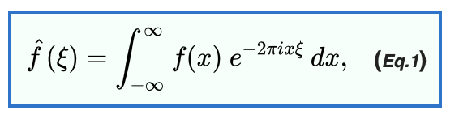
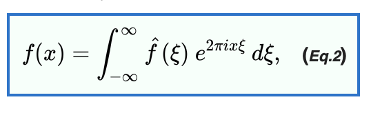

# **Fourier Transforms**

---

## **A little background on Fourier Transforms**

+ Fourier Analysis: Decomposing function
    + A signal or _convoluted_ function of amplitude/time is the summation of the amplitudes of its constituents
    + Fourier analysis helps to separate this convolution by changing from the time domain to the frequency domain. In this setting, it's easier to work.
    + Uses Euler identity as kernel and the Delta function to achieve a function transformations that will only peak at the characteristic attribute of every constituent of the convolution.
+ Fourier Synthesis: "Re-composing" function
    + You can apply the inverse of the Fourier Transform to the resulting function to get an approximation of the original one.

+ Fast Fourier Transform (FFT): A commmon method to calculate a discrete fourier transform

---

## Fourier Transform

## Inverse Fourier Transform

---

##  IR

---

### **Fractional Fourier Transform**

+ Propiedades y su relación con otras trasformadas de fourier
+ Da una generalización de la convencional transformada de fourier
(Detección de señales en sonidos e imágenes y análisis de frecuencias)

---

### **Harmonic Analysis**

+ Detection of harmonic signals with discrete fourier transform.
+ Errores al momento de implementar.

---

### **Noise removal in speech signal using fractional fourier transform**

+ Denoise the noisy speech signal.
+ The performance of Fractional Fourier Transform.

---
## Alternatives to FFT

---

### **Recent Developments in the Sparse Fourier Transform**

+ Survey
+ Addresses big data setting by computing a compressed Fourier transform, using only a subset of the input data, in time _sublinear_ to the data set size.
+ Sparse Fourier transform algorithms compute an approximation or compressed version of the DFT in time proportional to the sparsity of the spectrum of the signal (i.e., the number of dominant frequencies), as opposed to the length of the signal.

---
## Music

---
### **Applications of Fourier Analysis to Audio Signal Processing: An Investigation of Chord Detection Algorithms**

+ Algorithm:
    + Fourier analysis with FFT: transforms pitches into octave-independent chroma.
    + Hidden Markov Model, trained with set of pre-annotated audio files + Viterbi alignment algorithm to align chord labels

---

### **ON THE MATHEMATICS OF MUSIC: FROM CHORDS TO FOURIER ANALYSIS - Lensen - 2013.pdf**

+ Music theory and mathematical background in Fourier Analysis

---

### **Design and Evaluation of a Simple Chord Detection Algorithm - Hausner - 2014 [Thesis].pdf**

+ Algorithm:
    + Derive chord probabilities from pitch with _chord templates_
    + (No Machine Learning or Statistical Methods)

---

## Fourier Transforms in Graphs

---

### **The Emerging Field of Signal Processing on Graphs - Shuman - 2013.pdf**

+ Tries to extend high-dimensional data analysis and other irregular domains
+ Poses the challenge of generalizing elementary operations such as filtering, convolution and translation to graph setting

---
### **Big Data Analysis with Signal Processing on Graphs - Sandryhaila - 2014.pdf**

+ Big data poses new challenge: more information
+ Can be represented as nodes
+ Signal processing on nodes can be approached through graph Fourier transform

---

### **Are There Approximate Fast Fourier Transforms On Graphs? - Magorau - 2016.pdf**

+ Survey of algorithms
+ Generalize classical signal processing techniques to graph signals.
+ Signals live on the vertices of a graph instead of a regular grid
+ Proposes $Fa\muST$, approximation method

---

## FFT v.s. DFT?

---

### What about FFT v.s. DFT?

---

### An Algorithm for the Machine Calculation of Complex Fourier Series - Cooley Tukey - 1965

+ One of the most efficient algorithm to solve Fourier Series.
+ O(N^2) --> O(NlgN)

---

## FFT Applications: Audio and Image

+ Suppression of Acoustic Noise in Speech Using Spectral Subtraction - 1979
+ Fourier Transform based Windowed Adaptive Switching Minimum Filter for Reducing Periodic Noise from Digital Images - 2015
+ Noise reduction algorithms using Fibonacci Fourier transforms - 2008

---

## FFT Applications: Misc

+ he Fast Fourier Transform and Its Applications - Cooley Tukey - 1968
+ Diagnosis of Epilepsy in Patients Based on the Classification of EEG Signals Using Fast Fourier Transform - 2015
+ Fast Fourier Transform for Feature Extraction And Neural Network for Classification of Electrocardiogram Signals.

---

## FFT on GPU

+ cusFFT: A High-Performance Sparse Fast Fourier Transform Algorithm on GPUs - 2016
