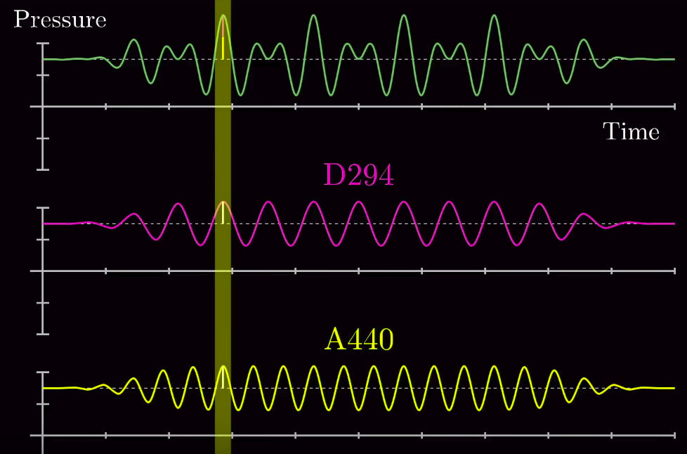

# Fourier Transform

---

## Index

+ Theory
    + Basic mathematical background
    + Fourier Transform derivation
+ Application
    + Algorithm 1
    + Algorithm 2

---

## Theory

---

### Spoiler

> A system's frequency response, $H$ is the Fourier Transform of it's impulse response, $h$.

---

### Discrete-time signals

Discrete-time signals are represented as sequences of numbers $x$, in which the $n^{th}$ number in the sequence is denoted $x[n]$ is formally written as:

`Eq. 2.1`:

$$
x = \{x [n] \} \quad -\infty < n < \infty
$$

If such sequence arises from periodic sampling of an analog signal $x_a(t)$, the numeric value of the nth number in the sequence is equal to the value of the analog signal, $x_a(t)$, at time $nT$.

---

`Eq. 2.2`:

$$
x = x_a(nT) \quad -\infty < n < \infty
$$

The quantity $T$ is the _sampling period_, and its reciprical is the _sampling frequency_.

---

The _unit sample sequence_ is defined as the sequence:

`Eq. 2.3`:
$$
\partial[n] =
\begin{cases}
  0, & n \neq 0, \\
  1, & n =  0.
\end{cases}
$$

_Note_: the unit sample sequence plays the same role for discrete-time signals and systems that the unit impulse function (Dirac delta function) does for continuous-time ssignals and systens. The unit samples sequence is often referred as an _impulse_.

---

One important aspects of the impulse sequence is that and arbitrary sequence can be represented as a sum of scaled, delayed impulses.

`Eq. 2.5`:
$$
x[n] = \sum_{k=-\infty}^{\infty}x[k]\partial[n-k]
$$

---

## Discrete-time systems

A discrete-time system is defined mathematically as a transformation or operator that maps an input sequence with values $x[n]$ into an output sequence with values $y[n]$.

`Eq. 2.19`
$$
y[n] = T\{x[n]\}
$$

---

## Linear Systems
The class of linear systems is defined by the principle of superposition. If $y_1[n]$ and $y_2[n]$ are the responses of a system when $x_1[n]$ and $x_2[n]$ are the respective inputs, then the system is linear iff it holds for the _additive property_ and the _homogeneity_ / _scaling property_.

The principle of superposition can be defined as:

`Eq. 2.24`
$$
T\{ax_1[n] + bx_2[n]\} = aT\{x_1[n]\} + bT\{x_2[n]\}
$$

---

## Time-Invariant systems

A time-invariant system (also, shift-invariant system) is a system for which a time shift or delay of the input sequence causes a corresponding shift in the output sequence.

This means that for all $n_0$, the input sequence with values $x_1[n] = x_2[n]$ produces the output sequence with values $y_1[n] = y[n-n_0]$.

---

## LTI systems (linear and time invariant)

+ Must abide linearity property (additivity and homogeneity principles)
+ If the linearity property is combined with the representation of a general sequence a s a linear combination of delayed impulses (`Eq. 2.5`), it follows that a linear system can be completely characterized by its impulse response.
+ Specifically, let $h_k[n]$ be the response of the system to the input $\partial[n-k]$, an impulse ocurring at $n = k$. Then, using `Eq. 2.5` to represent the input it follows that:

`Eq. 2.47`
$$
y[n] = T\{ \sum_{k=-\infty}^{\infty} x[k]\partial[n - k] \}
$$

---

and the principle of superposition in `Eq. 2.24`, we can write

`Eq. 2.48`
$$
y[n] = \sum_{k=-\infty}^{\infty} T\{x[k]\partial[n - k]\} = \sum_{k=-\infty}^{\infty} T\{x[k]h_k[n]\}
$$

---

Applying the constraint of time invariance:

`Eq. 2.49`
$$
y[n] = \sum_{k=-\infty}^{\infty} T\{x[k]\partial[n - k]\} = \sum_{k=-\infty}^{\infty} T\{x[k]h_k[n]\} = x[n] * h[n]
$$

---

Substituting into `Eq. 2.61`, with input $x[n] = e^{jwn}$

---

#### Why sinusoids?

They are the only waveform that does not change shape when subject to a linear invariant system.

---

## Application

### Image processing

In terms of blurred images, if the motion blur on said image is shift-invariante then it is usually modeled as a convolution of that image. Meaning that the blurred image actually has 2 components:

- Latent image: The original image that has been affected by a blur kernel
- Motion blur: The blur kernel that applied to the image causes the blur

Now there are 2 methods for image deconvolution:

- _Non-blind Deconvolution_ :  In this method it is assumed that you already have the blur kernel and you just need to do the reverse operation

- _Blind Deconvolution_: In blind deconvolution there is also as an additional task, using some kind of modeling strategy, to find out the closes possible blur kernel to the original one.

  Some popular strategies for finding these motion deconvolutions ranged from proposing 2 consequente instances of an image in time, rotating the image, etc. However they all proved either inexact or had a high computational cost.

An easy iterative blind approach would be as follows:

 __L´ = argminL { ||B - K *  L  || + pL(L) }__

 __K´ = argminL { ||B - K *  L  || + pK(K }__

given that the motion blur equations is

~~~C
B= K * L + N
~~~

where the basic terms

~~~C
B = blurred image
K = motion kernel or PSF (point spread function)
L = current latent image
~~~

However we are going to be using FFT to speed up the process of the calculations. To do this we will devide the operations in 3 steps:

* Prediction: Here we will predict a base L value to be used in the next step. This will be a really simple blind approximation using Gaussian prior.

* Kernel Estimation: Using our base case L we will use FFT to accuratly approximate K as much as possible

* Deconvolution: Since we now have all the elements needed to produce the "clear" image we will again apply FFT to deconvolute.

